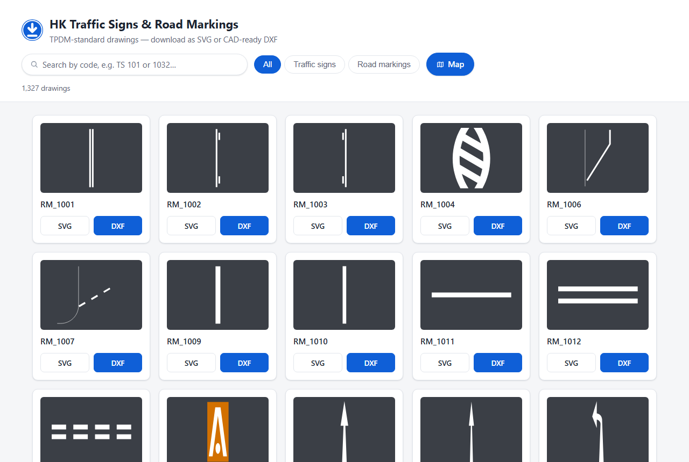
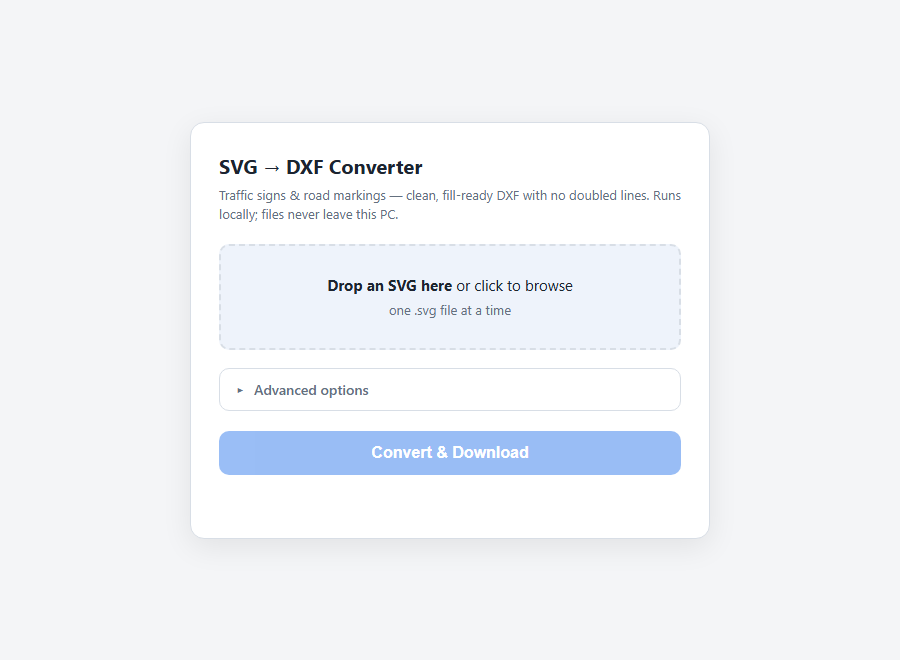

# svg2dxf — clean SVG → DXF for traffic signs & road markings

Converts SVG traffic signs / road markings into DXF that arrives **already
colored** — every shape is a solid fill with a clean outline, with **no
doubled or overlapping lines**, correct at any zoom level in AutoCAD.

> ### 🚦 Just need the sign files? Skip the converter.
>
> We have already sorted out **all 1,327 Hong Kong TPDM-standard traffic
> signs and road markings** and converted every one of them for you.
> Browse, search, and download any sign as **SVG or CAD-ready DXF** here:
>
> **https://lecberg.github.io/hk-tpdm-traffic-signs-markings/**
>
> [](https://lecberg.github.io/hk-tpdm-traffic-signs-markings/)
>
> Search by code (e.g. `TS 101`, `RM 1032`), filter by traffic signs vs
> road markings, and click **SVG** or **DXF** on any card. No install, no
> conversion — the DXFs are pre-generated with this very tool.
>
> You only need the converter below if you want to convert **your own**
> SVG files (or rebuild the collection with different tolerances).

## How the converter works

Instead of translating SVG paths one-by-one (the cause of doubled lines in
generic converters), it repaints the drawing the way the SVG renders:

1. **Parse & flatten** — all transforms applied, curves adaptively flattened.
2. **Snap** — vertices snapped to a grid, closing micro-gaps and making
   near-coincident edges exactly coincident.
3. **Painter's-algorithm overlay** — shapes stack in z-order; fully hidden
   geometry is removed, and strokes that merely outline a filled shape (the
   classic double line) are dropped.
4. **Write DXF** — per shape, a solid HATCH plus its closed LWPOLYLINE
   outline in the same color, hairline weight, stacked in drawing order on
   true-color layers (`FILL_RED_C1121F` etc.). Entities carry their own
   colors, so moving them to your own layers never changes how they look.
   Large white areas painted on a color take that color for their outline;
   small white shapes (characters) keep white outlines so text stays legible
   when zoomed far out.

## Using the converter

### Step 0 — Install (once)

Requires Python 3.10+. From the project folder:

```
pip install -e .
```

### Option A — Web interface (easiest)



1. Double-click **`start_converter.bat`** (or run `python -m svg2dxf.webapp`).
   A local server starts and your browser opens at `http://127.0.0.1:8517`.
2. Drag an SVG file onto the page (or click to browse).
3. Click **Convert & Download** — the DXF downloads to your browser's
   download folder.
4. Need to tweak? Open the collapsible **Advanced options** panel to adjust
   curve tolerance, snap tolerance, or scale before converting.

Everything runs locally; files never leave your PC.

### Option B — Command line (single files or whole folders)

```
svg2dxf sign.svg                    # -> sign.dxf next to the input
svg2dxf sign.svg -o out/sign.dxf    # choose the output path
svg2dxf signs_folder/ -o out/       # batch convert every .svg in a folder
```

Options:

| Option | Default | Meaning |
|---|---|---|
| `--curve-tol` | 0.05 | max curve-flattening error (SVG units); smaller = smoother |
| `--snap-tol` | 0.01 | vertex snap grid; raise it if your SVGs have sloppier gaps |
| `--scale` | 1.0 | multiply coordinates (e.g. px → mm) |
| `--stroke-as-outline` | off | turn strokes into filled bands (buffered by stroke width) |
| `-v` | off | print per-file warnings (skipped text elements, etc.) |

Standalone stroked lines (no fill — e.g. road-marking centerlines) are kept
as open polylines on `STROKE_<color>` layers.

### Opening the result in CAD

Open the DXF in AutoCAD (or any DXF-capable CAD): every colored region is a
solid HATCH plus a closed outline in the same true color, so the sign looks
right immediately at any zoom. Entities carry their own colors, so you can
move them onto your own layers without changing their appearance.

Need DWG? Batch-convert the DXF output with the free
[ODA File Converter](https://www.opendesign.com/guestfiles/oda_file_converter).

## Tests

```
python -m pytest tests/
```

Each test SVG in `tests/data/` reproduces one real failure mode: stroke+fill
double outlines, shared edges between adjacent regions, fully hidden stacked
shapes, and filled paths with micro-gaps.

## Download site (`site/`)

The source of the hosted gallery above: a fully static page (no server
logic) listing every SVG in `svgs/` with per-file SVG / DXF downloads,
code search, and traffic-sign / road-marking filters. It deploys to GitHub
Pages automatically via `.github/workflows/pages.yml` whenever a commit
touches `site/`.

Regenerate after changing `svgs/` or the converter:

```
python scripts/build_site.py          # converts only new/changed files
python scripts/build_site.py --force  # reconvert everything
```

Preview locally: `python -m http.server 8618 --directory site`

## Traffic signs map (`site/map.html`)

An interactive Leaflet map showing all ~157,000 surveyed traffic signs in
Hong Kong at their real locations, rendered with this repo's TPDM sign SVGs
as markers. Zoom in past level 15 to see signs as dots, past 17 to see the
actual sign faces; click any sign for its code, facing angle, and SVG/DXF
downloads. Supports `#zoom/lat/lng` deep links and filtering by code.

Data sources (both free, open data):

- **Sign locations**: Transport Department, [Traffic Aids Drawings (2nd
  generation)](https://data.gov.hk/en-data/dataset/hk-td-tis_16-traffic-aids-drawings-v2)
  — the `DTAD_TS_ABV_PT` layer (traffic sign abbreviation points), updated
  monthly.
- **Basemap**: Lands Department map tiles via the
  [CSDI portal](https://portal.csdi.gov.hk/).

To refresh the sign locations after a dataset update:

```
curl -LO https://static.data.gov.hk/td/traffic-aids-drawings-v2/DTAD_TS_ABV_PT.kmz
unzip DTAD_TS_ABV_PT.kmz doc.kml
python scripts/build_map_data.py doc.kml site/map-data
```

This regenerates `site/map-data/` — per-grid-cell JSON files the map page
loads lazily as you pan, so the full 157k-point dataset never loads at once.
