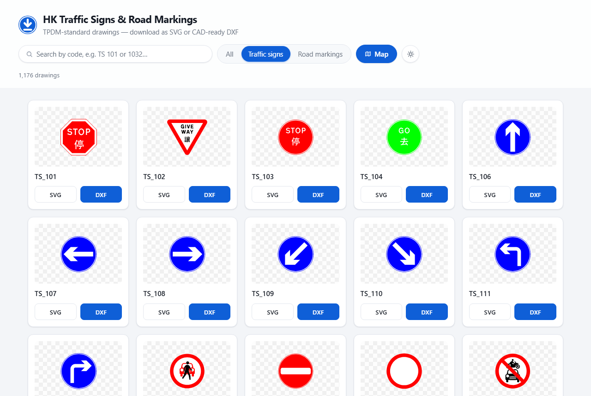
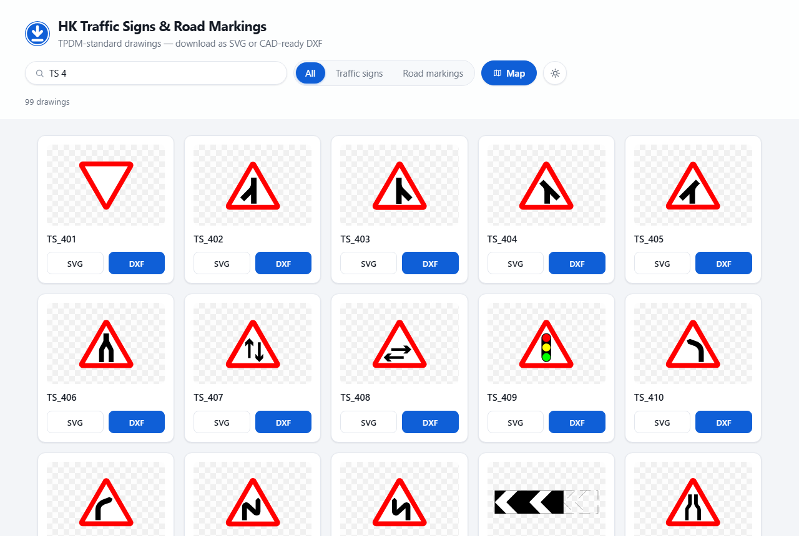
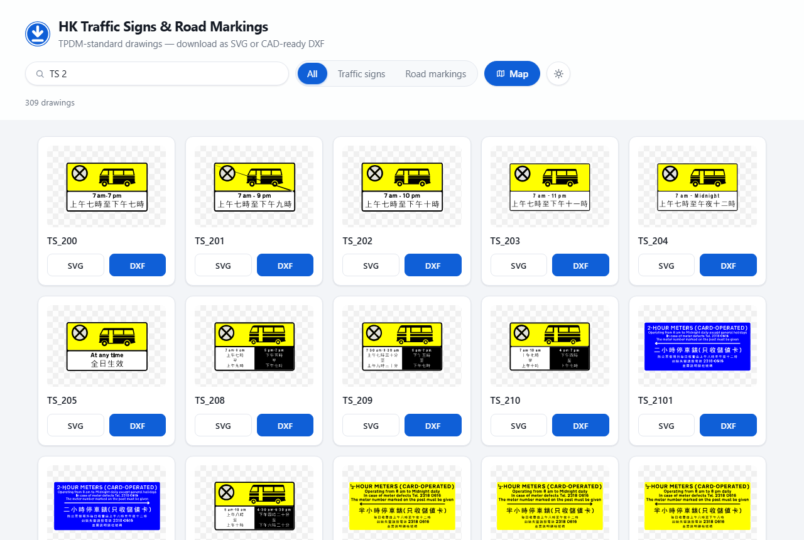
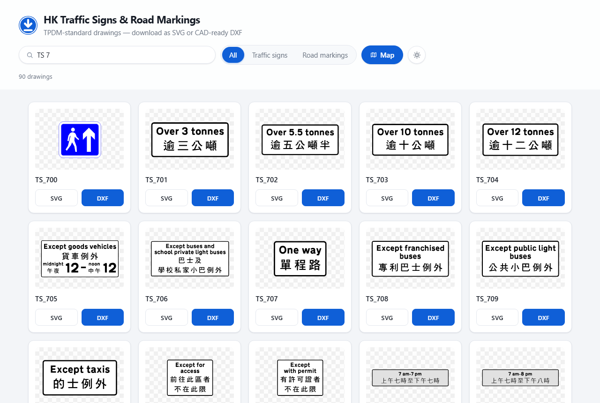
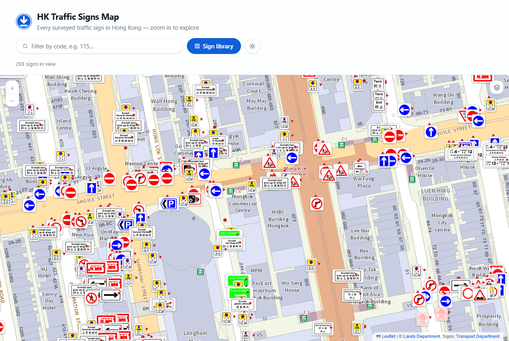
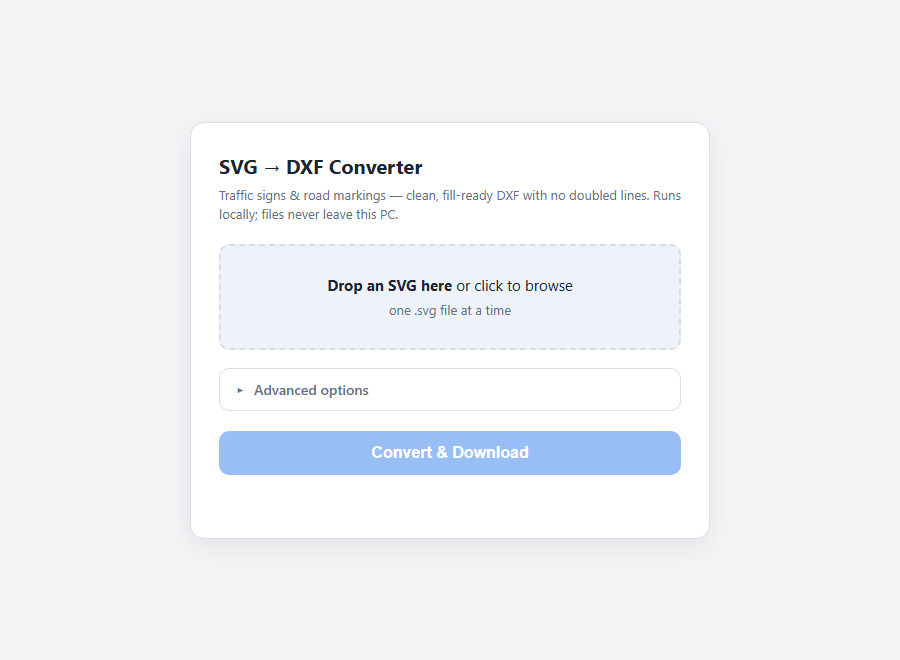

# svg2dxf — clean SVG → DXF for traffic signs & road markings

Converts SVG traffic signs / road markings into DXF that arrives **already
colored** — every shape is a solid fill with a clean outline, with **no
doubled or overlapping lines**, correct at any zoom level in AutoCAD.

> ### 🚦 Just need the sign files? Skip the converter.
>
> We have already sorted out **all 1,327 Hong Kong TPDM-standard traffic
> signs and road markings** and converted every one of them for you.
> Browse, search, and download any sign as **SVG or CAD-ready DXF** here:
>
> **https://lecberg.github.io/hk-tpdm-traffic-signs-markings/**
>
> | [](https://lecberg.github.io/hk-tpdm-traffic-signs-markings/?cat=TS) | [](https://lecberg.github.io/hk-tpdm-traffic-signs-markings/?q=TS%204) |
> |---|---|
> | **Regulatory** — stop, give way, mandatory, prohibition | **Warning** — junctions, bends, narrowing, signals |
> | [](https://lecberg.github.io/hk-tpdm-traffic-signs-markings/?q=TS%202) | [](https://lecberg.github.io/hk-tpdm-traffic-signs-markings/?q=TS%207) |
> | **Restriction zones** — no-stopping, metered parking | **Supplementary plates** — bilingual text panels |
>
> Search by code (e.g. `TS 101`, `RM 1032`), filter by traffic signs vs
> road markings, and click **SVG** or **DXF** on any card. No install, no
> conversion — the DXFs are pre-generated with this very tool.
>
> ### 🗺️ Or explore the signs on a map
>
> Every one of Hong Kong's ~157,000 surveyed traffic signs, at its real
> location — zoom in to see the actual sign faces, click one to download it:
>
> **https://lecberg.github.io/hk-tpdm-traffic-signs-markings/map.html**
>
> [](https://lecberg.github.io/hk-tpdm-traffic-signs-markings/map.html)
>
> You only need the converter below if you want to convert **your own**
> SVG files (or rebuild the collection with different tolerances).

## How the converter works

Instead of translating SVG paths one-by-one (the cause of doubled lines in
generic converters), it repaints the drawing the way the SVG renders:

1. **Parse & flatten** — all transforms applied, curves adaptively flattened.
2. **Snap** — vertices snapped to a grid, closing micro-gaps and making
   near-coincident edges exactly coincident.
3. **Painter's-algorithm overlay** — shapes stack in z-order; fully hidden
   geometry is removed, and strokes that merely outline a filled shape (the
   classic double line) are dropped.
4. **Write DXF** — per shape, a solid HATCH plus its closed LWPOLYLINE
   outline in the same color, hairline weight, stacked in drawing order on
   true-color layers (`FILL_RED_C1121F` etc.). Entities carry their own
   colors, so moving them to your own layers never changes how they look.
   Large white areas painted on a color take that color for their outline;
   small white shapes (characters) keep white outlines so text stays legible
   when zoomed far out.

## Using the converter

### Step 0 — Install (once)

Requires Python 3.9+. From the project folder:

```
pip install -e .
```

### Option A — Web interface (easiest)



1. Double-click **`start_converter.bat`** (or run `python -m svg2dxf.webapp`).
   A local server starts and your browser opens at `http://127.0.0.1:8517`.
2. Drag an SVG file onto the page (or click to browse).
3. Click **Convert & Download** — the DXF downloads to your browser's
   download folder.
4. Need to tweak? Open the collapsible **Advanced options** panel to adjust
   curve tolerance, snap tolerance, or scale before converting.

Everything runs locally; files never leave your PC.

### Option B — Local Docker edition (pilot)

This edition has separate Gallery and Map sections. The Gallery shows drawings
and downloads. The Map has an assistant panel for catalog search, map queries,
SVG conversion, and optional model chat. It is separate from the public GitHub
Pages site.

1. Install and start Docker Desktop or another Docker engine with Compose.
2. Copy `.env.example` to `.env`. Choose `AI_PROVIDER` and set that provider's
   key and model. The custom provider also needs a base URL. Leave keys empty
   if you only want search, map queries, and conversion.
3. From this folder, run `docker compose up --build -d`.
4. Open `http://localhost:8517`. Stop it with `docker compose down`.

The web service listens only on `127.0.0.1:8517`. The backend is internal to
Compose. The API key goes only to the backend container and the selected model
service. Chat messages and selected tool results go to that service. Uploaded SVG
bytes are used only by the local converter and are not sent to the model.
Map tiles still require internet access.

The local Docker edition supports four chat routes:

| `AI_PROVIDER` | Key in `.env` | Model setting |
|---|---|---|
| `openai` | `OPENAI_API_KEY` | `OPENAI_MODEL` |
| `deepseek` | `DEEPSEEK_API_KEY` | `DEEPSEEK_MODEL` (default `deepseek-flash`) |
| `vercel` | `AI_GATEWAY_API_KEY` | `AI_GATEWAY_MODEL` (required `provider/model` ID) |
| `custom` | `CUSTOM_API_KEY` | `CUSTOM_MODEL` and `CUSTOM_API_BASE_URL` |

For example, to use DeepSeek, set `AI_PROVIDER=deepseek` and fill in
`DEEPSEEK_API_KEY`. To use [Vercel AI Gateway](https://vercel.com/docs/ai-gateway/sdks-and-apis/openai-chat-completions),
set `AI_PROVIDER=vercel`, fill in `AI_GATEWAY_API_KEY`, and choose a model from
the [gateway model catalog](https://vercel.com/ai-gateway/models) that supports
tool calls. Vercel AI SDK is a client library; this Python backend uses the
Gateway's compatible API. DeepSeek's current model and API details are in its
[official documentation](https://api-docs.deepseek.com/).

To use another service that accepts OpenAI-style chat requests, fill in these
lines in `.env`:

```text
AI_PROVIDER=custom
CUSTOM_API_BASE_URL=https://example.com/v1
CUSTOM_MODEL=your-model
CUSTOM_API_KEY=your-key
```

The base URL is the API root, not the full `/chat/completions` address.
The model must support tool calls, which let it ask the server to search signs
or count map records. For a local service without authentication,
use a placeholder key. The backend sends the key and chat requests to this URL,
so use a service you trust and HTTPS for a remote service. A service running on
the same computer as Docker may need `host.docker.internal` in its URL instead
of `localhost`.

After editing `.env`, run `docker compose up -d --force-recreate backend` and
refresh the page. The panel shows the configured provider and, when chat is
available, its model. Provider keys are read by the backend; the website has
no key entry field. Only one provider is active at a time. Live chat needs a
compatible service and its required credentials.

The assistant uses checked tool results for visible facts. The model chooses
the tools. It cannot supply its own sign codes, counts, names, or links in a
reply. Chat remembers the last eight turns while browsing the map.
Repeated turn IDs reuse the saved result. Each visit allows five chat turns per
minute. The local service allows 60 turns per hour overall and two active
model calls.

This is still a **pilot**. The 100 most common downloadable sign codes in the
current map survey are frozen in `data/sign-review-queue.json`. Five batches of
20 previews are in `docs/sign-review-batches/`. The project owner approved all
100 bilingual names on 2026-09-24. The assistant searches these names and all
1,327 drawing codes. The other 1,227 drawings remain code-only. The
place index has eight named places and centre reference points for all 18
districts. These points are not district boundaries. When a name is missing
from that list, the local server asks the [Lands Department location search](https://tools.csdi.gov.hk/csdi-webpage/apidoc/LocationSearchAPI)
for up to 10 location points. The user chooses a result before the map counts
signs within 0.5 km. These points may not mark a building entrance. Place names
entered for this lookup are sent to the Lands Department. A service failure
does not prevent searches of the saved places. Surveyed records can exist
without downloadable artwork. SVG viewBox numbers are not physical dimensions.

DeepSeek is the primary configured chat service. A recorded live run with
unlisted place questions passed 28/30 English and 30/30 Traditional Chinese
tasks, with no invented visible codes, counts, links, or coordinates. See
`docs/evaluations/deepseek-20260924-174929.json`. The checked tasks cover
code and name search, downloads, saved and unlisted places, map counts,
follow-ups, and help. Two English map requests could not be verified because
the model changed the supplied point. OpenAI and
Vercel Gateway remain experimental.
Run `python scripts/evaluate_deepseek.py --live` to repeat the paid check.

Uploads, conversion outputs, and chat history stay in one in-memory session.
They expire after one hour of inactivity or when the backend restarts. One
conversion can run at a time; another request gets a retryable busy response.
Uploads are limited to 20 MiB, and conversion stops after 30 seconds.

If the panel says chat is unavailable, check `AI_PROVIDER`, its matching key,
and its model in `.env`, then recreate the backend as above. Search and
conversion do not need a key. If the
container is unhealthy, run `docker compose ps` and `docker compose logs backend`.
The legacy `python -m svg2dxf.webapp` converter remains available without Docker.

### Option C — Command line (single files or whole folders)

```
svg2dxf sign.svg                    # -> sign.dxf next to the input
svg2dxf sign.svg -o out/sign.dxf    # choose the output path
svg2dxf signs_folder/ -o out/       # batch convert every .svg in a folder
```

Options:

| Option | Default | Meaning |
|---|---|---|
| `--curve-tol` | 0.05 | max curve-flattening error (SVG units); smaller = smoother |
| `--snap-tol` | 0.01 | vertex snap grid; raise it if your SVGs have sloppier gaps |
| `--scale` | 1.0 | multiply coordinates (e.g. px → mm) |
| `--stroke-as-outline` | off | turn strokes into filled bands (buffered by stroke width) |
| `-v` | off | print per-file warnings (skipped text elements, etc.) |

Standalone stroked lines (no fill — e.g. road-marking centerlines) are kept
as open polylines on `STROKE_<color>` layers.

### Opening the result in CAD

Open the DXF in AutoCAD (or any DXF-capable CAD): every colored region is a
solid HATCH plus a closed outline in the same true color, so the sign looks
right immediately at any zoom. Entities carry their own colors, so you can
move them onto your own layers without changing their appearance.

Need DWG? Batch-convert the DXF output with the free
[ODA File Converter](https://www.opendesign.com/guestfiles/oda_file_converter).

## Tests

```
python -m pytest tests/
```

Each test SVG in `tests/data/` reproduces one real failure mode: stroke+fill
double outlines, shared edges between adjacent regions, fully hidden stacked
shapes, and filled paths with micro-gaps.

## Download site (`site/`)

The source of the hosted gallery above: a fully static page (no server
logic) listing every SVG in `svgs/` with per-file SVG / DXF downloads,
code search, and traffic-sign / road-marking filters. It deploys to GitHub
Pages automatically via `.github/workflows/pages.yml` whenever a commit
touches `site/`.

Regenerate after changing `svgs/` or the converter:

```
python scripts/build_site.py          # converts only new/changed files
python scripts/build_site.py --force  # reconvert everything
```

Gallery cards are served from `site/thumbs/`, small lossless WebP rasters of
the drawings — a card shows 167x120 px of art that can run to 772 vector
paths. A thumb is kept only where it is smaller than the gzipped SVG it
replaces, so the simple road markings keep their SVG; `thumbs/index.json`
lists the codes that have one. Rebuild after changing `svgs/`:

```
python scripts/build_thumbs.py          # only new/changed files
python scripts/build_thumbs.py --force  # redo everything
```

DXF downloads are served compressed. GitHub Pages gzips only a whitelist of
content types and DXF is not on it, so a 924 KB drawing went out at 924 KB;
`assets/dxf-download.js` fetches the `.dxf.gz` built beside it and inflates it
in the browser, which is about 8x less over the wire. The plain `.dxf` stays
in place for direct links and for browsers without `DecompressionStream` —
the script only enhances a link that already works. Rebuild after
`build_site.py`:

```
python scripts/build_dxf_gz.py          # only new/changed files
python scripts/build_dxf_gz.py --force  # redo everything
```

Preview locally: `python -m http.server 8618 --directory site`

## Traffic signs map (`site/map.html`)

An interactive Leaflet map showing all ~157,000 surveyed traffic signs in
Hong Kong at their real locations, rendered with this repo's TPDM sign SVGs
as markers. Zoom in past level 15 to see signs as dots, past 17 to see the
actual sign faces; click any sign for its code, facing angle, and SVG/DXF
downloads. Supports `#zoom/lat/lng` deep links and filtering by code.
(See the screenshot and live link at the top of this README.)

Data sources (both free, open data):

- **Sign locations**: Transport Department, [Traffic Aids Drawings (2nd
  generation)](https://data.gov.hk/en-data/dataset/hk-td-tis_16-traffic-aids-drawings-v2)
  — the `DTAD_TS_ABV_PT` layer (traffic sign abbreviation points), updated
  monthly.
- **Basemap**: Lands Department map tiles via the
  [CSDI portal](https://portal.csdi.gov.hk/).

To refresh the sign locations after a dataset update:

```
curl -LO https://static.data.gov.hk/td/traffic-aids-drawings-v2/DTAD_TS_ABV_PT.kmz
unzip DTAD_TS_ABV_PT.kmz doc.kml
python scripts/build_map_data.py doc.kml site/map-data
```

This regenerates `site/map-data/` — per-grid-cell JSON files the map page
loads lazily as you pan, so the full 157k-point dataset never loads at once.
Sign density is very uneven, so any cell whose file would exceed 200 KB is
split into an n×n grid of parts named `<x>_<y>_<i>-<j>.json` (Kowloon's
26k-sign cell becomes 3×3). A view of one junction then fetches a part
instead of a whole district; `index.json` records the split factors.

Marker icons come from `site/map-icons/` — copies of the sign SVGs cropped
to their content bounding box (the gallery SVGs share a TPDM drawing-sheet
canvas with lots of whitespace, which would render tiny on the map).
Regenerate them after changing `svgs/`:

```
python scripts/build_map_icons.py          # only new/changed files
python scripts/build_map_icons.py --force  # redo everything
```
