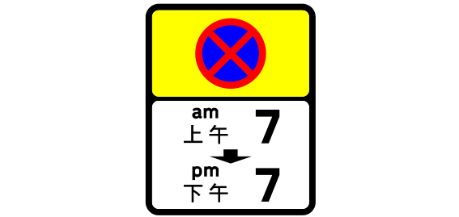
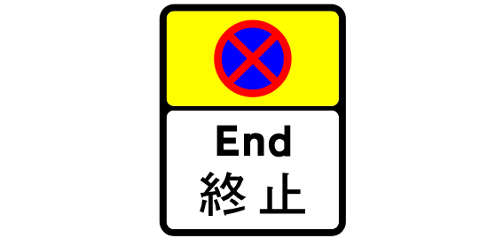
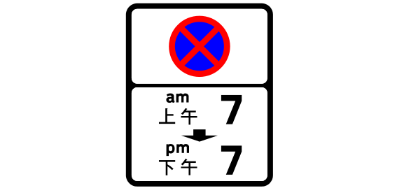

# Sign review batch 1 of 5

The project owner approved all 20 entries in this batch on 2026-09-24.
The approved names remain linked to their source and drawing for later review.

## 1. TS_115 — 9015 map records

- Approved English: No entry
- 已核准繁體中文：不准駛入
- Approved aliases: None
- [Official manual](https://www.td.gov.hk/filemanager/en/content_5055/V3_08_2026.pdf#page=30) · [SVG](../../site/svgs/TS_115.svg) · [DXF](../../site/dxfs/TS_115.dxf)
- Additional source: [Open source](https://commons.wikimedia.org/wiki/File:HK_traffic_sign_115.svg)
- Review state: verified; approved by project owner on 2026-09-24

## 2. TS_102 — 7188 map records

- Approved English: Give Way
- 已核准繁體中文：讓路
- Approved aliases: None
- [Official manual](https://www.td.gov.hk/filemanager/en/content_5055/V3_08_2026.pdf#page=23) · [SVG](../../site/svgs/TS_102.svg) · [DXF](../../site/dxfs/TS_102.dxf)
- Additional source: None
- Review state: verified; approved by project owner on 2026-09-24

## 3. TS_460 — 6298 map records

- Approved English: Pedestrians on the road ahead
- 已核准繁體中文：前方道路上的行人
- Approved aliases: None
- [Official manual](https://www.td.gov.hk/filemanager/en/content_5055/V3_08_2026.pdf#page=73) · [SVG](../../site/svgs/TS_460.svg) · [DXF](../../site/dxfs/TS_460.dxf)
- Additional source: [Open source](https://commons.wikimedia.org/wiki/File:HK_traffic_sign_460.svg)
- Review state: verified; approved by project owner on 2026-09-24

## 4. TS_860 — 6022 map records

- Approved English: Except taxi drop off
- 已核准繁體中文：除的士落客外
- Approved aliases: None
- [Official manual](https://www.td.gov.hk/filemanager/en/content_5055/V3_08_2026.pdf#page=47) · [SVG](../../site/svgs/TS_860.svg) · [DXF](../../site/dxfs/TS_860.dxf)
- Additional source: None
- Review state: verified; approved by project owner on 2026-09-24

## 5. TS_280 — 4470 map records

- Approved English: Parking
- 已核准繁體中文：泊車
- Approved aliases: None
- [Official manual](https://www.td.gov.hk/filemanager/en/content_5055/V3_08_2026.pdf#page=117) · [SVG](../../site/svgs/TS_280.svg) · [DXF](../../site/dxfs/TS_280.dxf)
- Additional source: [Open source](https://commons.wikimedia.org/wiki/File:HK_traffic_sign_280.svg)
- Review state: verified; approved by project owner on 2026-09-24

## 6. TS_182 — 4285 map records

- Approved English: One-way traffic
- 已核准繁體中文：單向交通
- Approved aliases: None
- [Official manual](https://www.td.gov.hk/filemanager/en/content_5055/V3_08_2026.pdf#page=45) · [SVG](../../site/svgs/TS_182.svg) · [DXF](../../site/dxfs/TS_182.dxf)
- Additional source: [Open source](https://commons.wikimedia.org/wiki/File:HK_traffic_sign_182.svg)
- Review state: verified; approved by project owner on 2026-09-24

## 7. TS_107 — 4171 map records

- Approved English: Turn left
- 已核准繁體中文：左轉
- Approved aliases: None
- [Official manual](https://www.td.gov.hk/filemanager/en/content_5055/V3_08_2026.pdf#page=26) · [SVG](../../site/svgs/TS_107.svg) · [DXF](../../site/dxfs/TS_107.dxf)
- Additional source: [Open source](https://commons.wikimedia.org/wiki/File:HK_traffic_sign_107.svg)
- Review state: verified; approved by project owner on 2026-09-24

## 8. TS_414 — 3005 map records

- Approved English: Left-pointing chevron
- 已核准繁體中文：向左箭紋標誌
- Approved aliases: None
- [Official manual](https://www.td.gov.hk/filemanager/en/content_5055/V3_08_2026.pdf#page=67) · [SVG](../../site/svgs/TS_414.svg) · [DXF](../../site/dxfs/TS_414.dxf)
- Additional source: [Open source](../../site/svgs/TS_414.svg)
- Review state: verified; approved by project owner on 2026-09-24

## 9. TS_734 — 2673 map records

- Approved English: Directional arrow sign
- 已核准繁體中文：方向指示箭頭標誌
- Approved aliases: None
- [Official manual](https://www.td.gov.hk/filemanager/en/content_5055/V3_08_2026.pdf#page=102) · [SVG](../../site/svgs/TS_734.svg) · [DXF](../../site/dxfs/TS_734.dxf)
- Additional source: [Open source](https://commons.wikimedia.org/wiki/File:HK_traffic_sign_734.svg)
- Review state: verified; approved by project owner on 2026-09-24

## 10. TS_733 — 2611 map records

- Approved English: Directional arrow sign
- 已核准繁體中文：方向指示箭頭標誌
- Approved aliases: None
- [Official manual](https://www.td.gov.hk/filemanager/en/content_5055/V3_08_2026.pdf#page=122) · [SVG](../../site/svgs/TS_733.svg) · [DXF](../../site/dxfs/TS_733.dxf)
- Additional source: [Open source](https://commons.wikimedia.org/wiki/File:HK_traffic_sign_733.svg)
- Review state: verified; approved by project owner on 2026-09-24

## 11. TS_116 — 2560 map records

- Approved English: All vehicles prohibited in both directions
- 已核准繁體中文：禁止來往方向的一切車輛駛入
- Approved aliases: None
- [Official manual](https://www.td.gov.hk/filemanager/en/content_5055/V3_08_2026.pdf#page=31) · [SVG](../../site/svgs/TS_116.svg) · [DXF](../../site/dxfs/TS_116.dxf)
- Additional source: [Open source](https://commons.wikimedia.org/wiki/File:HK_traffic_sign_116.svg)
- Review state: verified; approved by project owner on 2026-09-24

## 12. TS_2133 — 2507 map records

- Approved English: No stopping zone from 7 a.m. to 7 p.m. (start sign)
- 已核准繁體中文：上午七時至下午七時不准停車區（ 開始標誌 ）
- Approved aliases: None
- [Official manual](https://www.td.gov.hk/filemanager/en/content_5055/V3_08_2026.pdf#page=45) · [SVG](../../site/svgs/TS_2133.svg) · [DXF](../../site/dxfs/TS_2133.dxf)
- Additional source: [Open source](https://commons.wikimedia.org/wiki/File:HK_traffic_sign_2133.svg)
- Review state: verified; approved by project owner on 2026-09-24

## 13. TS_283 — 2382 map records

- Approved English: Parking for motorcycles only
- 已核准繁體中文：僅限摩托車停車
- Approved aliases: None
- [Official manual](https://www.td.gov.hk/filemanager/en/content_5055/V3_08_2026.pdf#page=117) · [SVG](../../site/svgs/TS_283.svg) · [DXF](../../site/dxfs/TS_283.dxf)
- Additional source: [Open source](https://commons.wikimedia.org/wiki/File:HK_traffic_sign_283.svg)
- Review state: verified; approved by project owner on 2026-09-24

## 14. TS_2139 — 2372 map records

- Approved English: No stopping zone ends
- 已核准繁體中文：不准停車區終止
- Approved aliases: None
- [Official manual](https://www.td.gov.hk/filemanager/en/content_5055/V3_08_2026.pdf#page=46) · [SVG](../../site/svgs/TS_2139.svg) · [DXF](../../site/dxfs/TS_2139.dxf)
- Additional source: [Open source](https://commons.wikimedia.org/wiki/File:HK_traffic_sign_2139.svg)
- Review state: verified; approved by project owner on 2026-09-24

## 15. TS_589 — 2343 map records

- Approved English: Shortened version of Chevron sign
- 已核准繁體中文：縮短版箭咀標誌
- Approved aliases: None
- [Official manual](https://www.td.gov.hk/filemanager/en/content_5055/V3_08_2026.pdf#page=66) · [SVG](../../site/svgs/TS_589.svg) · [DXF](../../site/dxfs/TS_589.dxf)
- Additional source: None
- Review state: verified; approved by project owner on 2026-09-24

## 16. TS_133 — 2208 map records

- Approved English: No U-turn
- 已核准繁體中文：不准掉頭
- Approved aliases: None
- [Official manual](https://www.td.gov.hk/filemanager/en/content_5055/V3_08_2026.pdf#page=37) · [SVG](../../site/svgs/TS_133.svg) · [DXF](../../site/dxfs/TS_133.dxf)
- Additional source: [Open source](https://commons.wikimedia.org/wiki/File:HK_traffic_sign_133.svg)
- Review state: verified; approved by project owner on 2026-09-24

## 17. TS_838 — 2177 map records

- Approved English: Except General Holidays
- 已核准繁體中文：公眾假期除外
- Approved aliases: None
- [Official manual](https://www.td.gov.hk/filemanager/en/content_5055/V3_08_2026.pdf#page=114) · [SVG](../../site/svgs/TS_838.svg) · [DXF](../../site/dxfs/TS_838.dxf)
- Additional source: None
- Review state: verified; approved by project owner on 2026-09-24

## 18. TS_2134 — 1882 map records

- Approved English: No stopping zone from 7 a.m. to 7 p.m. (repeater sign)
- 已核准繁體中文：上午七時至下午七時不准停車區（ 重複標誌 ）
- Approved aliases: None
- [Official manual](https://www.td.gov.hk/filemanager/en/content_5055/V3_08_2026.pdf#page=51) · [SVG](../../site/svgs/TS_2134.svg) · [DXF](../../site/dxfs/TS_2134.dxf)
- Additional source: [Open source](https://commons.wikimedia.org/wiki/File:HK_traffic_sign_2134.svg)
- Review state: verified; approved by project owner on 2026-09-24

## 19. TS_180 — 1728 map records

- Approved English: Segregated Pathway
- 已核准繁體中文：分開的路徑
- Approved aliases: None
- [Official manual](https://www.td.gov.hk/filemanager/en/content_5055/V3_08_2026.pdf#page=44) · [SVG](../../site/svgs/TS_180.svg) · [DXF](../../site/dxfs/TS_180.dxf)
- Additional source: [Open source](https://commons.wikimedia.org/wiki/File:HK_traffic_sign_180.svg)
- Review state: verified; approved by project owner on 2026-09-24

## 20. TS_108 — 1724 map records

- Approved English: Turn right
- 已核准繁體中文：右轉
- Approved aliases: None
- [Official manual](https://www.td.gov.hk/filemanager/en/content_5055/V3_08_2026.pdf#page=26) · [SVG](../../site/svgs/TS_108.svg) · [DXF](../../site/dxfs/TS_108.dxf)
- Additional source: [Open source](https://commons.wikimedia.org/wiki/File:HK_traffic_sign_108.svg)
- Review state: verified; approved by project owner on 2026-09-24
