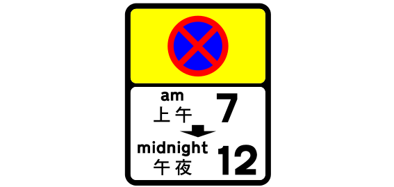
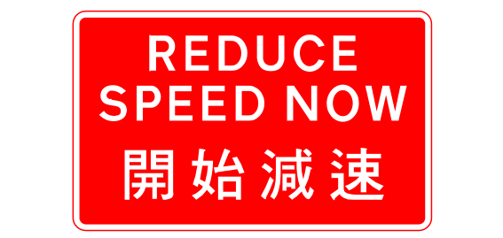
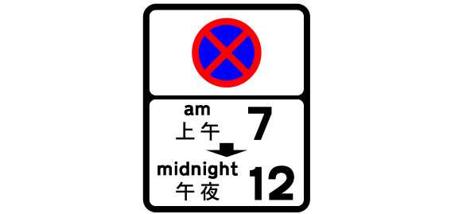
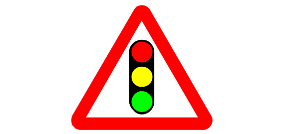
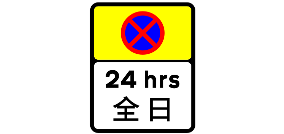
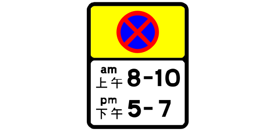
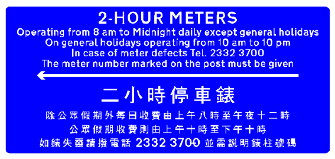
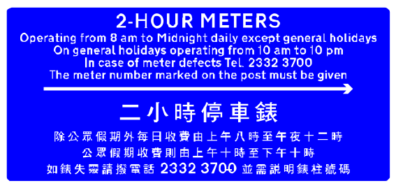

# Sign review batch 2 of 5

The project owner approved all 20 entries in this batch on 2026-09-24.
The approved names remain linked to their source and drawing for later review.

## 21. TS_132 — 1711 map records

- Approved English: No right turn
- 已核准繁體中文：不准右轉
- Approved aliases: None
- [Official manual](https://www.td.gov.hk/filemanager/en/content_5055/V3_08_2026.pdf#page=26) · [SVG](../../site/svgs/TS_132.svg) · [DXF](../../site/dxfs/TS_132.dxf)
- Additional source: [Open source](https://commons.wikimedia.org/wiki/File:HK_traffic_sign_132.svg)
- Review state: verified; approved by project owner on 2026-09-24

## 22. TS_2131 — 1704 map records

- Approved English: No stopping zone from 7 a.m. to midnight (start sign)
- 已核准繁體中文：上午七時至午夜十二時不准停車區（ 開始標誌 ）
- Approved aliases: None
- [Official manual](https://www.td.gov.hk/filemanager/en/content_5055/V3_08_2026.pdf#page=46) · [SVG](../../site/svgs/TS_2131.svg) · [DXF](../../site/dxfs/TS_2131.dxf)
- Additional source: [Open source](https://commons.wikimedia.org/wiki/File:HK_traffic_sign_2131.svg)
- Review state: verified; approved by project owner on 2026-09-24

## 23. TS_322 — 1690 map records

- Approved English: Green minibus stand
- 已核准繁體中文：綠色小巴站
- Approved aliases: None
- [Official manual](https://www.td.gov.hk/filemanager/en/content_5055/V3_08_2026.pdf#page=124) · [SVG](../../site/svgs/TS_322.svg) · [DXF](../../site/dxfs/TS_322.dxf)
- Additional source: [Open source](../../site/svgs/TS_322.svg)
- Review state: verified; approved by project owner on 2026-09-24

## 24. TS_174 — 1673 map records

- Approved English: Speed Limit
- 已核准繁體中文：速度限制
- Approved aliases: None
- [Official manual](https://www.td.gov.hk/filemanager/en/content_5055/V3_08_2026.pdf#page=43) · [SVG](../../site/svgs/TS_174.svg) · [DXF](../../site/dxfs/TS_174.dxf)
- Additional source: None
- Review state: verified; approved by project owner on 2026-09-24

## 25. TS_284 — 1669 map records

- Approved English: Parking for pedal cycles only
- 已核准繁體中文：僅限腳踏車停車
- Approved aliases: None
- [Official manual](https://www.td.gov.hk/filemanager/en/content_5055/V3_08_2026.pdf#page=117) · [SVG](../../site/svgs/TS_284.svg) · [DXF](../../site/dxfs/TS_284.dxf)
- Additional source: [Open source](https://commons.wikimedia.org/wiki/File:HK_traffic_sign_284.svg)
- Review state: verified; approved by project owner on 2026-09-24

## 26. TS_588 — 1668 map records

- Approved English: Chevron
- 已核准繁體中文：箭咀
- Approved aliases: None
- [Official manual](https://www.td.gov.hk/filemanager/en/content_5055/V3_08_2026.pdf#page=66) · [SVG](../../site/svgs/TS_588.svg) · [DXF](../../site/dxfs/TS_588.dxf)
- Additional source: None
- Review state: verified; approved by project owner on 2026-09-24

## 27. TS_737 — 1658 map records

- Approved English: Reduce speed now
- 已核准繁體中文：開始減速
- Approved aliases: None
- [Official manual](https://www.td.gov.hk/filemanager/en/content_5055/V3_08_2026.pdf#page=103) · [SVG](../../site/svgs/TS_737.svg) · [DXF](../../site/dxfs/TS_737.dxf)
- Additional source: [Open source](https://commons.wikimedia.org/wiki/File:HK_traffic_sign_737.svg)
- Review state: verified; approved by project owner on 2026-09-24

## 28. TS_324 — 1612 map records

- Approved English: Taxi stand
- 已核准繁體中文：道路交通（ 交通管制 ）規例
- Approved aliases: None
- [Official manual](https://www.td.gov.hk/filemanager/en/content_5055/V3_08_2026.pdf#page=125) · [SVG](../../site/svgs/TS_324.svg) · [DXF](../../site/dxfs/TS_324.dxf)
- Additional source: [Open source](https://commons.wikimedia.org/wiki/File:HK_traffic_sign_324.svg)
- Review state: verified; approved by project owner on 2026-09-24

## 29. TS_101 — 1596 map records

- Approved English: Stop
- 已核准繁體中文：停車
- Approved aliases: None
- [Official manual](https://www.td.gov.hk/filemanager/en/content_5055/V3_08_2026.pdf#page=21) · [SVG](../../site/svgs/TS_101.svg) · [DXF](../../site/dxfs/TS_101.dxf)
- Additional source: None
- Review state: verified; approved by project owner on 2026-09-24

## 30. TS_281 — 1551 map records

- Approved English: Parking for goods vehicles only
- 已核准繁體中文：僅限貨車停車
- Approved aliases: None
- [Official manual](https://www.td.gov.hk/filemanager/en/content_5055/V3_08_2026.pdf#page=117) · [SVG](../../site/svgs/TS_281.svg) · [DXF](../../site/dxfs/TS_281.dxf)
- Additional source: [Open source](https://commons.wikimedia.org/wiki/File:HK_traffic_sign_281.svg)
- Review state: verified; approved by project owner on 2026-09-24

## 31. TS_175 — 1511 map records

- Approved English: 70 km/h speed limit
- 已核准繁體中文：時速七十公里限制
- Approved aliases: None
- [Official manual](https://www.td.gov.hk/filemanager/en/content_5055/V3_08_2026.pdf) · [SVG](../../site/svgs/TS_175.svg) · [DXF](../../site/dxfs/TS_175.dxf)
- Additional source: [Open source](../../site/svgs/TS_175.svg)
- Review state: verified; approved by project owner on 2026-09-24

## 32. TS_179 — 1499 map records

- Approved English: Segregated Pathway
- 已核准繁體中文：分開的路徑
- Approved aliases: None
- [Official manual](https://www.td.gov.hk/filemanager/en/content_5055/V3_08_2026.pdf#page=44) · [SVG](../../site/svgs/TS_179.svg) · [DXF](../../site/dxfs/TS_179.dxf)
- Additional source: [Open source](https://commons.wikimedia.org/wiki/File:HK_traffic_sign_179.svg)
- Review state: verified; approved by project owner on 2026-09-24

## 33. TS_2132 — 1487 map records

- Approved English: No stopping zone from 7 a.m. to midnight (repeater sign)
- 已核准繁體中文：上午七時至午夜十二時不准停車區（ 重複標誌 ）
- Approved aliases: None
- [Official manual](https://www.td.gov.hk/filemanager/en/content_5055/V3_08_2026.pdf#page=50) · [SVG](../../site/svgs/TS_2132.svg) · [DXF](../../site/dxfs/TS_2132.dxf)
- Additional source: [Open source](https://commons.wikimedia.org/wiki/File:HK_traffic_sign_2132.svg)
- Review state: verified; approved by project owner on 2026-09-24

## 34. TS_409 — 1463 map records

- Approved English: Traffic signals ahead
- 已核准繁體中文：前面交通燈號
- Approved aliases: None
- [Official manual](https://www.td.gov.hk/filemanager/en/content_5055/V3_08_2026.pdf#page=64) · [SVG](../../site/svgs/TS_409.svg) · [DXF](../../site/dxfs/TS_409.dxf)
- Additional source: [Open source](https://commons.wikimedia.org/wiki/File:HK_traffic_sign_409.svg)
- Review state: verified; approved by project owner on 2026-09-24

## 35. TS_119 — 1451 map records

- Approved English: Minibuses are Prohibited
- 已核准繁體中文：小巴被禁止
- Approved aliases: None
- [Official manual](https://www.td.gov.hk/filemanager/en/content_5055/V3_08_2026.pdf#page=33) · [SVG](../../site/svgs/TS_119.svg) · [DXF](../../site/dxfs/TS_119.dxf)
- Additional source: [Open source](https://commons.wikimedia.org/wiki/File:HK_traffic_sign_119.svg)
- Review state: verified; approved by project owner on 2026-09-24

## 36. TS_2137 — 1427 map records

- Approved English: 24 hour no stopping zone (start sign)
- 已核准繁體中文：全日不准停車區（ 開始標誌 ）
- Approved aliases: None
- [Official manual](https://www.td.gov.hk/filemanager/en/content_5055/V3_08_2026.pdf#page=46) · [SVG](../../site/svgs/TS_2137.svg) · [DXF](../../site/dxfs/TS_2137.dxf)
- Additional source: [Open source](https://commons.wikimedia.org/wiki/File:HK_traffic_sign_2137.svg)
- Review state: verified; approved by project owner on 2026-09-24

## 37. TS_2230 — 1358 map records

- Approved English: No stopping zone from 8 a.m. to 10 a.m. and from 5 p.m. to 7 p.m. (start sign)
- 已核准繁體中文：上午八時至十時及下午五時至七時不准停車區（ 開始標誌 ）
- Approved aliases: None
- [Official manual](https://www.td.gov.hk/filemanager/en/content_5055/V3_08_2026.pdf#page=46) · [SVG](../../site/svgs/TS_2230.svg) · [DXF](../../site/dxfs/TS_2230.dxf)
- Additional source: [Open source](https://commons.wikimedia.org/wiki/File:HK_traffic_sign_2230.svg)
- Review state: verified; approved by project owner on 2026-09-24

## 38. TS_183 — 1160 map records

- Approved English: No stopping
- 已核准繁體中文：不准停車
- Approved aliases: None
- [Official manual](https://www.td.gov.hk/filemanager/en/content_5055/V3_08_2026.pdf#page=46) · [SVG](../../site/svgs/TS_183.svg) · [DXF](../../site/dxfs/TS_183.dxf)
- Additional source: [Open source](https://commons.wikimedia.org/wiki/File:HK_traffic_sign_183.svg)
- Review state: verified; approved by project owner on 2026-09-24

## 39. TS_2238 — 1143 map records

- Approved English: Two-hour parking meters
- 已核准繁體中文：兩小時停車收費錶
- Approved aliases: None
- [Official manual](https://www.td.gov.hk/filemanager/en/content_5055/V3_08_2026.pdf) · [SVG](../../site/svgs/TS_2238.svg) · [DXF](../../site/dxfs/TS_2238.dxf)
- Additional source: [Open source](../../site/svgs/TS_2238.svg)
- Review state: verified; approved by project owner on 2026-09-24

## 40. TS_2239 — 1138 map records

- Approved English: Two-hour parking meters
- 已核准繁體中文：兩小時停車收費錶
- Approved aliases: None
- [Official manual](https://www.td.gov.hk/filemanager/en/content_5055/V3_08_2026.pdf) · [SVG](../../site/svgs/TS_2239.svg) · [DXF](../../site/dxfs/TS_2239.dxf)
- Additional source: [Open source](../../site/svgs/TS_2239.svg)
- Review state: verified; approved by project owner on 2026-09-24
