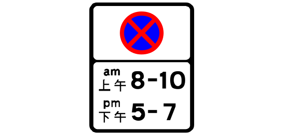
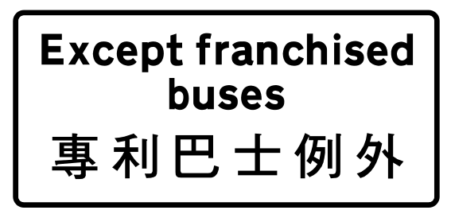
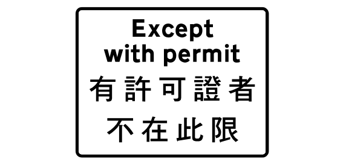

# Sign review batch 3 of 5

The project owner approved all 20 entries in this batch on 2026-09-24.
The approved names remain linked to their source and drawing for later review.

## 41. TS_2231 — 1050 map records

- Approved English: No stopping zone from 8 a.m. to 10 a.m. and from 5 p.m. to 7 p.m. (repeater sign)
- 已核准繁體中文：上午八時至十時及下午五時至七時不准停車區（ 重複標誌 ）
- Approved aliases: None
- [Official manual](https://www.td.gov.hk/filemanager/en/content_5055/V3_08_2026.pdf#page=50) · [SVG](../../site/svgs/TS_2231.svg) · [DXF](../../site/dxfs/TS_2231.dxf)
- Additional source: [Open source](https://commons.wikimedia.org/wiki/File:HK_traffic_sign_2231.svg)
- Review state: verified; approved by project owner on 2026-09-24

## 42. TS_106 — 1004 map records

- Approved English: Go straight ahead only
- 已核准繁體中文：只准駛前
- Approved aliases: None
- [Official manual](https://www.td.gov.hk/filemanager/en/content_5055/V3_08_2026.pdf#page=26) · [SVG](../../site/svgs/TS_106.svg) · [DXF](../../site/dxfs/TS_106.dxf)
- Additional source: [Open source](https://commons.wikimedia.org/wiki/File:HK_traffic_sign_106.svg)
- Review state: verified; approved by project owner on 2026-09-24

## 43. TS_425 — 989 map records

- Approved English: Roundabout
- 已核准繁體中文：迂迴
- Approved aliases: None
- [Official manual](https://www.td.gov.hk/filemanager/en/content_5055/V3_08_2026.pdf#page=70) · [SVG](../../site/svgs/TS_425.svg) · [DXF](../../site/dxfs/TS_425.dxf)
- Additional source: [Open source](https://commons.wikimedia.org/wiki/File:HK_traffic_sign_425.svg)
- Review state: verified; approved by project owner on 2026-09-24

## 44. TS_735 — 985 map records

- Approved English: Directional arrow sign
- 已核准繁體中文：方向指示箭頭標誌
- Approved aliases: None
- [Official manual](https://www.td.gov.hk/filemanager/en/content_5055/V3_08_2026.pdf#page=122) · [SVG](../../site/svgs/TS_735.svg) · [DXF](../../site/dxfs/TS_735.dxf)
- Additional source: [Open source](https://commons.wikimedia.org/wiki/File:HK_traffic_sign_735.svg)
- Review state: verified; approved by project owner on 2026-09-24

## 45. TS_581 — 974 map records

- Approved English: Traffic enforcement camera
- 已核准繁體中文：交通執法攝影機
- Approved aliases: None
- [Official manual](https://www.td.gov.hk/filemanager/en/content_5055/V3_08_2026.pdf) · [SVG](../../site/svgs/TS_581.svg) · [DXF](../../site/dxfs/TS_581.dxf)
- Additional source: [Open source](../../site/svgs/TS_581.svg)
- Review state: verified; approved by project owner on 2026-09-24

## 46. TS_131 — 968 map records

- Approved English: No left turn
- 已核准繁體中文：不准左轉
- Approved aliases: None
- [Official manual](https://www.td.gov.hk/filemanager/en/content_5055/V3_08_2026.pdf#page=36) · [SVG](../../site/svgs/TS_131.svg) · [DXF](../../site/dxfs/TS_131.dxf)
- Additional source: [Open source](https://commons.wikimedia.org/wiki/File:HK_traffic_sign_131.svg)
- Review state: verified; approved by project owner on 2026-09-24

## 47. TS_410 — 926 map records

- Approved English: Bend to the left ahead
- 已核准繁體中文：前方道路向左彎曲
- Approved aliases: None
- [Official manual](https://www.td.gov.hk/filemanager/en/content_5055/V3_08_2026.pdf#page=65) · [SVG](../../site/svgs/TS_410.svg) · [DXF](../../site/dxfs/TS_410.dxf)
- Additional source: [Open source](../../site/svgs/TS_410.svg)
- Review state: verified; approved by project owner on 2026-09-24

## 48. TS_463 — 901 map records

- Approved English: Watch out for children.
- 已核准繁體中文：當心孩子
- Approved aliases: None
- [Official manual](https://www.td.gov.hk/filemanager/en/content_5055/V3_08_2026.pdf#page=74) · [SVG](../../site/svgs/TS_463.svg) · [DXF](../../site/dxfs/TS_463.dxf)
- Additional source: [Open source](https://commons.wikimedia.org/wiki/File:HK_traffic_sign_463.svg)
- Review state: verified; approved by project owner on 2026-09-24

## 49. TS_411 — 852 map records

- Approved English: Bend to the right ahead
- 已核准繁體中文：前方道路向右彎曲
- Approved aliases: None
- [Official manual](https://www.td.gov.hk/filemanager/en/content_5055/V3_08_2026.pdf#page=65) · [SVG](../../site/svgs/TS_411.svg) · [DXF](../../site/dxfs/TS_411.dxf)
- Additional source: [Open source](../../site/svgs/TS_411.svg)
- Review state: verified; approved by project owner on 2026-09-24

## 50. TS_286 — 832 map records

- Approved English: No parking
- 已核准繁體中文：不准泊車
- Approved aliases: None
- [Official manual](https://www.td.gov.hk/filemanager/en/content_5055/V3_08_2026.pdf#page=122) · [SVG](../../site/svgs/TS_286.svg) · [DXF](../../site/dxfs/TS_286.dxf)
- Additional source: [Open source](https://commons.wikimedia.org/wiki/File:HK_traffic_sign_286.svg)
- Review state: verified; approved by project owner on 2026-09-24

## 51. TS_109 — 829 map records

- Approved English: Keep left
- 已核准繁體中文：靠左
- Approved aliases: None
- [Official manual](https://www.td.gov.hk/filemanager/en/content_5055/V3_08_2026.pdf#page=27) · [SVG](../../site/svgs/TS_109.svg) · [DXF](../../site/dxfs/TS_109.dxf)
- Additional source: [Open source](https://commons.wikimedia.org/wiki/File:HK_traffic_sign_109.svg)
- Review state: verified; approved by project owner on 2026-09-24

## 52. TS_740 — 785 map records

- Approved English: School
- 已核准繁體中文：學校
- Approved aliases: None
- [Official manual](https://www.td.gov.hk/filemanager/en/content_5055/V3_08_2026.pdf#page=106) · [SVG](../../site/svgs/TS_740.svg) · [DXF](../../site/dxfs/TS_740.dxf)
- Additional source: [Open source](https://commons.wikimedia.org/wiki/File:HK_traffic_sign_740.svg)
- Review state: verified; approved by project owner on 2026-09-24

## 53. TS_407 — 780 map records

- Approved English: Two-way traffic
- 已核准繁體中文：雙程行車
- Approved aliases: None
- [Official manual](https://www.td.gov.hk/filemanager/en/content_5055/V3_08_2026.pdf#page=61) · [SVG](../../site/svgs/TS_407.svg) · [DXF](../../site/dxfs/TS_407.dxf)
- Additional source: [Open source](https://commons.wikimedia.org/wiki/File:HK_traffic_sign_407.svg)
- Review state: verified; approved by project owner on 2026-09-24

## 54. TS_422 — 760 map records

- Approved English: Side road on the left ahead
- 已核准繁體中文：前面左邊有旁路
- Approved aliases: None
- [Official manual](https://www.td.gov.hk/filemanager/en/content_5055/V3_08_2026.pdf) · [SVG](../../site/svgs/TS_422.svg) · [DXF](../../site/dxfs/TS_422.dxf)
- Additional source: [Open source](https://commons.wikimedia.org/wiki/File:HK_traffic_sign_422.svg)
- Review state: verified; approved by project owner on 2026-09-24

## 55. TS_708 — 760 map records

- Approved English: Except franchised buses
- 已核准繁體中文：專利巴士例外
- Approved aliases: None
- [Official manual](https://www.td.gov.hk/filemanager/en/content_5055/V3_08_2026.pdf#page=27) · [SVG](../../site/svgs/TS_708.svg) · [DXF](../../site/dxfs/TS_708.dxf)
- Additional source: [Open source](https://commons.wikimedia.org/wiki/File:HK_traffic_sign_708.svg)
- Review state: verified; approved by project owner on 2026-09-24

## 56. TS_134 — 756 map records

- Approved English: No Pedestrians
- 已核准繁體中文：行人禁止通行
- Approved aliases: None
- [Official manual](https://www.td.gov.hk/filemanager/en/content_5055/V3_08_2026.pdf#page=38) · [SVG](../../site/svgs/TS_134.svg) · [DXF](../../site/dxfs/TS_134.dxf)
- Additional source: [Open source](https://commons.wikimedia.org/wiki/File:HK_traffic_sign_134.svg)
- Review state: verified; approved by project owner on 2026-09-24

## 57. TS_136 — 751 map records

- Approved English: No pedestrians, pedestrian controlled vehicles, bicycles and tricycles.
- 已核准繁體中文：沒有行人，行人控制的車輛，自行車，三輪車超出了這一點。
- Approved aliases: None
- [Official manual](https://www.td.gov.hk/filemanager/en/content_5055/V3_08_2026.pdf#page=38) · [SVG](../../site/svgs/TS_136.svg) · [DXF](../../site/dxfs/TS_136.dxf)
- Additional source: [Open source](https://commons.wikimedia.org/wiki/File:HK_traffic_sign_136.svg)
- Review state: verified; approved by project owner on 2026-09-24

## 58. TS_712 — 706 map records

- Approved English: Except with permit
- 已核准繁體中文：持有許可證者不在此限
- Approved aliases: None
- [Official manual](https://www.td.gov.hk/filemanager/en/content_5055/V3_08_2026.pdf#page=32) · [SVG](../../site/svgs/TS_712.svg) · [DXF](../../site/dxfs/TS_712.dxf)
- Additional source: [Open source](../../site/svgs/TS_712.svg)
- Review state: verified; approved by project owner on 2026-09-24

## 59. TS_620 — 693 map records

- Approved English: Passing place
- 已核准繁體中文：讓車處
- Approved aliases: None
- [Official manual](https://www.td.gov.hk/filemanager/en/content_5055/V3_08_2026.pdf#page=92) · [SVG](../../site/svgs/TS_620.svg) · [DXF](../../site/dxfs/TS_620.dxf)
- Additional source: [Open source](https://commons.wikimedia.org/wiki/File:HK_traffic_sign_620.svg)
- Review state: verified; approved by project owner on 2026-09-24

## 60. TS_176 — 688 map records

- Approved English: 80 km/h speed limit
- 已核准繁體中文：時速八十公里限制
- Approved aliases: None
- [Official manual](https://www.td.gov.hk/filemanager/en/content_5055/V3_08_2026.pdf) · [SVG](../../site/svgs/TS_176.svg) · [DXF](../../site/dxfs/TS_176.dxf)
- Additional source: [Open source](../../site/svgs/TS_176.svg)
- Review state: verified; approved by project owner on 2026-09-24
