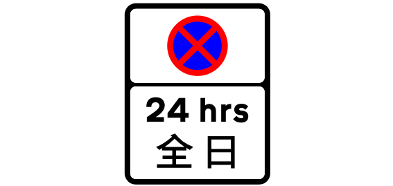
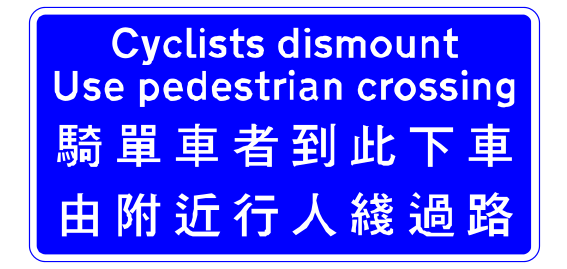
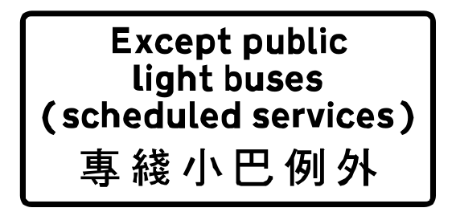
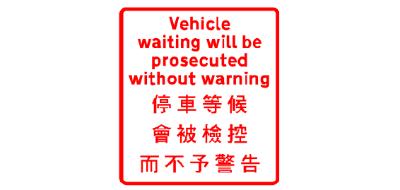
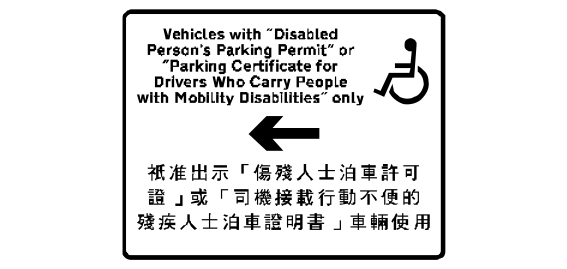
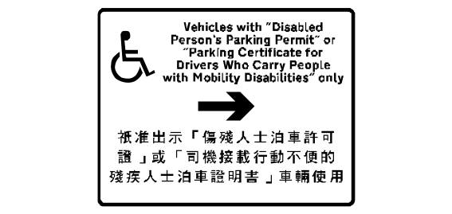

# Sign review batch 4 of 5

The project owner approved all 20 entries in this batch on 2026-09-24.
The approved names remain linked to their source and drawing for later review.

## 61. TS_2138 — 686 map records

- Approved English: 24 hour no stopping zone (repeater sign)
- 已核准繁體中文：全日不准停車區（ 重複標誌 ）
- Approved aliases: None
- [Official manual](https://www.td.gov.hk/filemanager/en/content_5055/V3_08_2026.pdf) · [SVG](../../site/svgs/TS_2138.svg) · [DXF](../../site/dxfs/TS_2138.dxf)
- Additional source: [Open source](https://commons.wikimedia.org/wiki/File:HK_traffic_sign_2138.svg)
- Review state: verified; approved by project owner on 2026-09-24

## 62. TS_130 — 672 map records

- Approved English: No motor vehicle driven by a 學 learner driver.
- 已核准繁體中文：無機動車由見習司機駕駛。
- Approved aliases: None
- [Official manual](https://www.td.gov.hk/filemanager/en/content_5055/V3_08_2026.pdf#page=36) · [SVG](../../site/svgs/TS_130.svg) · [DXF](../../site/dxfs/TS_130.dxf)
- Additional source: [Open source](https://commons.wikimedia.org/wiki/File:HK_traffic_sign_130.svg)
- Review state: verified; approved by project owner on 2026-09-24

## 63. TS_198 — 671 map records

- Approved English: End of no stopping restriction
- 已核准繁體中文：禁止停車限制終止
- Approved aliases: None
- [Official manual](https://www.td.gov.hk/filemanager/en/content_5055/V3_08_2026.pdf) · [SVG](../../site/svgs/TS_198.svg) · [DXF](../../site/dxfs/TS_198.dxf)
- Additional source: [Open source](../../site/svgs/TS_198.svg)
- Review state: verified; approved by project owner on 2026-09-24

## 64. TS_615 — 667 map records

- Approved English: No through road
- 已核准繁體中文：死胡同
- Approved aliases: None
- [Official manual](https://www.td.gov.hk/filemanager/en/content_5055/V3_08_2026.pdf#page=90) · [SVG](../../site/svgs/TS_615.svg) · [DXF](../../site/dxfs/TS_615.dxf)
- Additional source: [Open source](https://commons.wikimedia.org/wiki/File:HK_traffic_sign_615.svg)
- Review state: verified; approved by project owner on 2026-09-24

## 65. TS_117 — 639 map records

- Approved English: Motor Vehicles prohibited
- 已核准繁體中文：機動車輛禁止
- Approved aliases: None
- [Official manual](https://www.td.gov.hk/filemanager/en/content_5055/V3_08_2026.pdf#page=32) · [SVG](../../site/svgs/TS_117.svg) · [DXF](../../site/dxfs/TS_117.dxf)
- Additional source: [Open source](https://commons.wikimedia.org/wiki/File:HK_traffic_sign_117.svg)
- Review state: verified; approved by project owner on 2026-09-24

## 66. TS_225 — 606 map records

- Approved English: Cyclists dismount and use pedestrian crossing
- 已核准繁體中文：騎單車者到此下車，由附近行人綫過路
- Approved aliases: None
- [Official manual](https://www.td.gov.hk/filemanager/en/content_5055/V3_08_2026.pdf#page=56) · [SVG](../../site/svgs/TS_225.svg) · [DXF](../../site/dxfs/TS_225.dxf)
- Additional source: [Open source](https://commons.wikimedia.org/wiki/File:HK_traffic_sign_225.svg)
- Review state: verified; approved by project owner on 2026-09-24

## 67. TS_282 — 572 map records

- Approved English: Parking for buses only
- 已核准繁體中文：巴士專用泊車位
- Approved aliases: None
- [Official manual](https://www.td.gov.hk/filemanager/en/content_5055/V3_08_2026.pdf#page=117) · [SVG](../../site/svgs/TS_282.svg) · [DXF](../../site/dxfs/TS_282.dxf)
- Additional source: [Open source](../../site/svgs/TS_282.svg)
- Review state: verified; approved by project owner on 2026-09-24

## 68. TS_520 — 561 map records

- Approved English: Cyclist Crossing
- 已核准繁體中文：自行車道口
- Approved aliases: None
- [Official manual](https://www.td.gov.hk/filemanager/en/content_5055/V3_08_2026.pdf#page=85) · [SVG](../../site/svgs/TS_520.svg) · [DXF](../../site/dxfs/TS_520.dxf)
- Additional source: [Open source](https://commons.wikimedia.org/wiki/File:HK_traffic_sign_520.svg)
- Review state: verified; approved by project owner on 2026-09-24

## 69. TS_586 — 544 map records

- Approved English: Beware of Reversing Vehicles
- 已核准繁體中文：小心倒車車輛
- Approved aliases: None
- [Official manual](https://www.td.gov.hk/filemanager/en/content_5055/V3_08_2026.pdf#page=86) · [SVG](../../site/svgs/TS_586.svg) · [DXF](../../site/dxfs/TS_586.dxf)
- Additional source: [Open source](../../site/svgs/TS_586.svg)
- Review state: verified; approved by project owner on 2026-09-24

## 70. TS_323 — 537 map records

- Approved English: Public Light Bus Stand
- 已核准繁體中文：公共小型巴士站
- Approved aliases: None
- [Official manual](https://www.td.gov.hk/filemanager/en/content_5055/V3_08_2026.pdf#page=124) · [SVG](../../site/svgs/TS_323.svg) · [DXF](../../site/dxfs/TS_323.dxf)
- Additional source: None
- Review state: verified; approved by project owner on 2026-09-24

## 71. TS_852 — 507 map records

- Approved English: Except public light buses (scheduled services)
- 已核准繁體中文：專線小巴例外
- Approved aliases: None
- [Official manual](https://www.td.gov.hk/filemanager/en/content_5055/V3_08_2026.pdf) · [SVG](../../site/svgs/TS_852.svg) · [DXF](../../site/dxfs/TS_852.dxf)
- Additional source: [Open source](../../site/svgs/TS_852.svg)
- Review state: verified; approved by project owner on 2026-09-24

## 72. TS_2702 — 469 map records

- Approved English: Vehicle waiting will be prosecuted without warning
- 已核准繁體中文：停車等候會被檢控而不予警告
- Approved aliases: None
- [Official manual](https://www.td.gov.hk/filemanager/en/content_5055/V3_08_2026.pdf) · [SVG](../../site/svgs/TS_2702.svg) · [DXF](../../site/dxfs/TS_2702.dxf)
- Additional source: [Open source](../../site/svgs/TS_2702.svg)
- Review state: verified; approved by project owner on 2026-09-24

## 73. TS_769 — 466 map records

- Approved English: Distance plate
- 已核准繁體中文：距離標誌牌
- Approved aliases: None
- [Official manual](https://www.td.gov.hk/filemanager/en/content_5055/V3_08_2026.pdf#page=86) · [SVG](../../site/svgs/TS_769.svg) · [DXF](../../site/dxfs/TS_769.dxf)
- Additional source: None
- Review state: verified; approved by project owner on 2026-09-24

## 74. TS_347 — 460 map records

- Approved English: Disabled person permit parking only (left arrow)
- 已核准繁體中文：殘疾人士泊車許可證車輛專用（向左）
- Approved aliases: None
- [Official manual](https://www.td.gov.hk/filemanager/en/content_5055/V3_08_2026.pdf#page=121) · [SVG](../../site/svgs/TS_347.svg) · [DXF](../../site/dxfs/TS_347.dxf)
- Additional source: [Open source](../../site/svgs/TS_347.svg)
- Review state: verified; approved by project owner on 2026-09-24

## 75. TS_348 — 459 map records

- Approved English: Disabled person permit parking only (right arrow)
- 已核准繁體中文：殘疾人士泊車許可證車輛專用（向右）
- Approved aliases: None
- [Official manual](https://www.td.gov.hk/filemanager/en/content_5055/V3_08_2026.pdf) · [SVG](../../site/svgs/TS_348.svg) · [DXF](../../site/dxfs/TS_348.dxf)
- Additional source: [Open source](../../site/svgs/TS_348.svg)
- Review state: verified; approved by project owner on 2026-09-24

## 76. TS_461 — 441 map records

- Approved English: Pedestrian crossing ahead
- 已核准繁體中文：前面有行人過處
- Approved aliases: None
- [Official manual](https://www.td.gov.hk/filemanager/en/content_5055/V3_08_2026.pdf#page=73) · [SVG](../../site/svgs/TS_461.svg) · [DXF](../../site/dxfs/TS_461.dxf)
- Additional source: [Open source](https://commons.wikimedia.org/wiki/File:HK_traffic_sign_461.svg)
- Review state: verified; approved by project owner on 2026-09-24

## 77. TS_831 — 440 map records

- Approved English: Vehicle length
- 已核准繁體中文：車輛長度
- Approved aliases: None
- [Official manual](https://www.td.gov.hk/filemanager/en/content_5055/V3_08_2026.pdf#page=36) · [SVG](../../site/svgs/TS_831.svg) · [DXF](../../site/dxfs/TS_831.dxf)
- Additional source: None
- Review state: verified; approved by project owner on 2026-09-24

## 78. TS_483 — 403 map records

- Approved English: Cyclists dismount
- 已核准繁體中文：騎單車者下車
- Approved aliases: None
- [Official manual](https://www.td.gov.hk/filemanager/en/content_5055/V3_08_2026.pdf) · [SVG](../../site/svgs/TS_483.svg) · [DXF](../../site/dxfs/TS_483.dxf)
- Additional source: [Open source](../../site/svgs/TS_483.svg)
- Review state: verified; approved by project owner on 2026-09-24

## 79. TS_221 — 400 map records

- Approved English: In
- 已核准繁體中文：入
- Approved aliases: None
- [Official manual](https://www.td.gov.hk/filemanager/en/content_5055/V3_08_2026.pdf#page=55) · [SVG](../../site/svgs/TS_221.svg) · [DXF](../../site/dxfs/TS_221.dxf)
- Additional source: [Open source](https://commons.wikimedia.org/wiki/File:HK_traffic_sign_221.svg)
- Review state: verified; approved by project owner on 2026-09-24

## 80. TS_611 — 395 map records

- Approved English: Get in lane
- 已核准繁體中文：選定行車綫
- Approved aliases: None
- [Official manual](https://www.td.gov.hk/filemanager/en/content_5055/V3_08_2026.pdf#page=89) · [SVG](../../site/svgs/TS_611.svg) · [DXF](../../site/dxfs/TS_611.dxf)
- Additional source: [Open source](https://commons.wikimedia.org/wiki/File:HK_traffic_sign_611.svg)
- Review state: verified; approved by project owner on 2026-09-24
