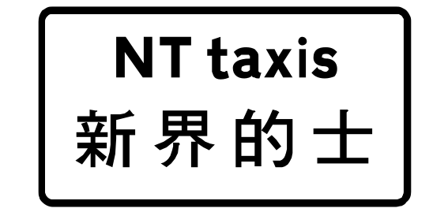
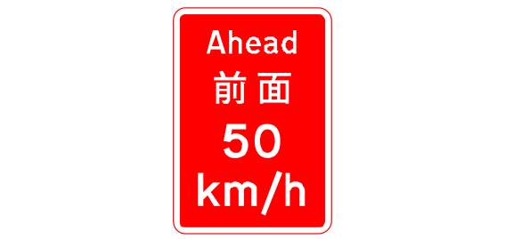
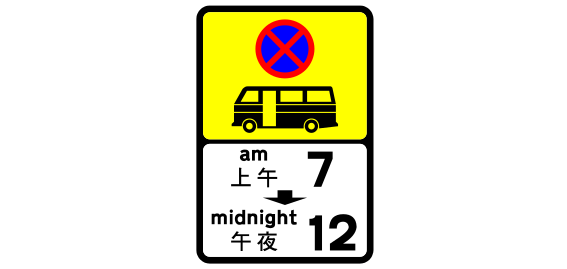
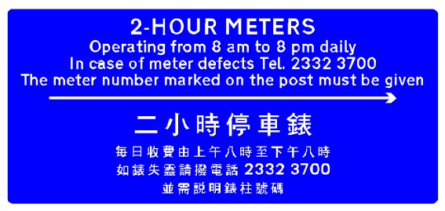
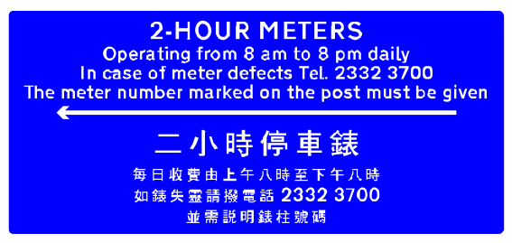
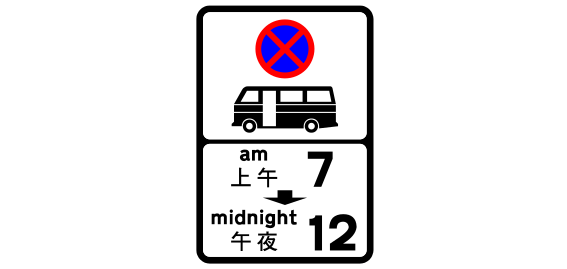
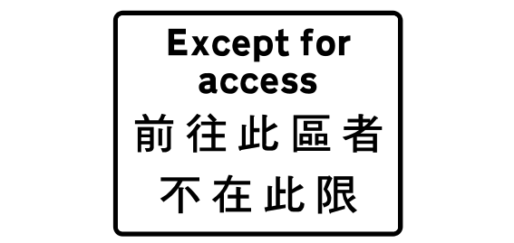
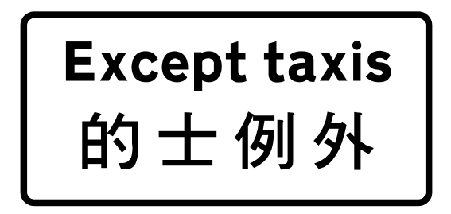

# Sign review batch 5 of 5

The project owner approved all 20 entries in this batch on 2026-09-24.
The approved names remain linked to their source and drawing for later review.

## 81. TS_333 — 393 map records

- Approved English: Light rail vehicles and trams only.
- 已核准繁體中文：輕軌車和電車只。
- Approved aliases: None
- [Official manual](https://www.td.gov.hk/filemanager/en/content_5055/V3_08_2026.pdf#page=57) · [SVG](../../site/svgs/TS_333.svg) · [DXF](../../site/dxfs/TS_333.dxf)
- Additional source: [Open source](https://commons.wikimedia.org/wiki/File:HK_traffic_sign_333.svg)
- Review state: verified; approved by project owner on 2026-09-24

## 82. TS_421 — 383 map records

- Approved English: Side road on the right ahead
- 已核准繁體中文：前面右邊有旁路
- Approved aliases: None
- [Official manual](https://www.td.gov.hk/filemanager/en/content_5055/V3_08_2026.pdf#page=70) · [SVG](../../site/svgs/TS_421.svg) · [DXF](../../site/dxfs/TS_421.dxf)
- Additional source: [Open source](https://commons.wikimedia.org/wiki/File:HK_traffic_sign_421.svg)
- Review state: verified; approved by project owner on 2026-09-24

## 83. TS_223 — 362 map records

- Approved English: No exit
- 已核准繁體中文：不准駛出
- Approved aliases: None
- [Official manual](https://www.td.gov.hk/filemanager/en/content_5055/V3_08_2026.pdf#page=56) · [SVG](../../site/svgs/TS_223.svg) · [DXF](../../site/dxfs/TS_223.dxf)
- Additional source: [Open source](https://commons.wikimedia.org/wiki/File:HK_traffic_sign_223.svg)
- Review state: verified; approved by project owner on 2026-09-24

## 84. TS_371 — 356 map records

- Approved English: Private road
- 已核准繁體中文：道路交通（ 交通管制 ）規例
- Approved aliases: None
- [Official manual](https://www.td.gov.hk/filemanager/en/content_5055/V3_08_2026.pdf#page=122) · [SVG](../../site/svgs/TS_371.svg) · [DXF](../../site/dxfs/TS_371.dxf)
- Additional source: [Open source](https://commons.wikimedia.org/wiki/File:HK_traffic_sign_371.svg)
- Review state: verified; approved by project owner on 2026-09-24

## 85. TS_818 — 354 map records

- Approved English: NT Taxis
- 已核准繁體中文：新界的士
- Approved aliases: None
- [Official manual](https://www.td.gov.hk/filemanager/en/content_5055/V3_08_2026.pdf#page=127) · [SVG](../../site/svgs/TS_818.svg) · [DXF](../../site/dxfs/TS_818.dxf)
- Additional source: None
- Review state: verified; approved by project owner on 2026-09-24

## 86. TS_222 — 343 map records

- Approved English: Out
- 已核准繁體中文：道路交通（ 交通管制 ）規例
- Approved aliases: None
- [Official manual](https://www.td.gov.hk/filemanager/en/content_5055/V3_08_2026.pdf#page=56) · [SVG](../../site/svgs/TS_222.svg) · [DXF](../../site/dxfs/TS_222.dxf)
- Additional source: [Open source](https://commons.wikimedia.org/wiki/File:HK_traffic_sign_222.svg)
- Review state: verified; approved by project owner on 2026-09-24

## 87. TS_570 — 328 map records

- Approved English: 50 km/h speed limit ahead
- 已核准繁體中文：前方時速五十公里限制
- Approved aliases: None
- [Official manual](https://www.td.gov.hk/filemanager/en/content_5055/V3_08_2026.pdf#page=86) · [SVG](../../site/svgs/TS_570.svg) · [DXF](../../site/dxfs/TS_570.dxf)
- Additional source: [Open source](../../site/svgs/TS_570.svg)
- Review state: verified; approved by project owner on 2026-09-24

## 88. TS_2140 — 325 map records

- Approved English: No stopping zone for public light buses from 7 a.m. to midnight (start sign)
- 已核准繁體中文：上午七時至午夜十二時公共小巴不准停車區（ 開始標誌 ）
- Approved aliases: None
- [Official manual](https://www.td.gov.hk/filemanager/en/content_5055/V3_08_2026.pdf) · [SVG](../../site/svgs/TS_2140.svg) · [DXF](../../site/dxfs/TS_2140.dxf)
- Additional source: [Open source](https://commons.wikimedia.org/wiki/File:HK_traffic_sign_2140.svg)
- Review state: verified; approved by project owner on 2026-09-24

## 89. TS_2235 — 321 map records

- Approved English: Two-hour parking meters
- 已核准繁體中文：兩小時停車收費錶
- Approved aliases: None
- [Official manual](https://www.td.gov.hk/filemanager/en/content_5055/V3_08_2026.pdf) · [SVG](../../site/svgs/TS_2235.svg) · [DXF](../../site/dxfs/TS_2235.dxf)
- Additional source: [Open source](../../site/svgs/TS_2235.svg)
- Review state: verified; approved by project owner on 2026-09-24

## 90. TS_2234 — 317 map records

- Approved English: Two-hour parking meters
- 已核准繁體中文：兩小時停車收費錶
- Approved aliases: None
- [Official manual](https://www.td.gov.hk/filemanager/en/content_5055/V3_08_2026.pdf) · [SVG](../../site/svgs/TS_2234.svg) · [DXF](../../site/dxfs/TS_2234.dxf)
- Additional source: [Open source](../../site/svgs/TS_2234.svg)
- Review state: verified; approved by project owner on 2026-09-24

## 91. TS_629 — 307 map records

- Approved English: Direction to parking place
- 已核准繁體中文：泊車處方向
- Approved aliases: None
- [Official manual](https://www.td.gov.hk/filemanager/en/content_5055/V3_08_2026.pdf) · [SVG](../../site/svgs/TS_629.svg) · [DXF](../../site/dxfs/TS_629.dxf)
- Additional source: [Open source](https://commons.wikimedia.org/wiki/File:HK_traffic_sign_629.svg)
- Review state: verified; approved by project owner on 2026-09-24

## 92. TS_191 — 287 map records

- Approved English: Keep left unless overtaking
- 已核准繁體中文：除越過前車外靠左駛
- Approved aliases: None
- [Official manual](https://www.td.gov.hk/filemanager/en/content_5055/V3_08_2026.pdf#page=40) · [SVG](../../site/svgs/TS_191.svg) · [DXF](../../site/dxfs/TS_191.dxf)
- Additional source: [Open source](../../site/svgs/TS_191.svg)
- Review state: verified; approved by project owner on 2026-09-24

## 93. TS_2141 — 287 map records

- Approved English: No stopping zone for public light buses from 7 a.m. to midnight (repeater sign)
- 已核准繁體中文：上午七時至午夜十二時公共小巴不准停車區（ 重複標誌 ）
- Approved aliases: None
- [Official manual](https://www.td.gov.hk/filemanager/en/content_5055/V3_08_2026.pdf) · [SVG](../../site/svgs/TS_2141.svg) · [DXF](../../site/dxfs/TS_2141.dxf)
- Additional source: [Open source](https://commons.wikimedia.org/wiki/File:HK_traffic_sign_2141.svg)
- Review state: verified; approved by project owner on 2026-09-24

## 94. TS_524 — 287 map records

- Approved English: Light Rail or Tram Crossing ahead.
- 已核准繁體中文：輕軌或電車道口。
- Approved aliases: None
- [Official manual](https://www.td.gov.hk/filemanager/en/content_5055/V3_08_2026.pdf#page=85) · [SVG](../../site/svgs/TS_524.svg) · [DXF](../../site/dxfs/TS_524.dxf)
- Additional source: [Open source](https://commons.wikimedia.org/wiki/File:HK_traffic_sign_524.svg)
- Review state: verified; approved by project owner on 2026-09-24

## 95. TS_177 — 281 map records

- Approved English: 100 km/h speed limit
- 已核准繁體中文：時速一百公里限制
- Approved aliases: None
- [Official manual](https://www.td.gov.hk/filemanager/en/content_5055/V3_08_2026.pdf) · [SVG](../../site/svgs/TS_177.svg) · [DXF](../../site/dxfs/TS_177.dxf)
- Additional source: [Open source](../../site/svgs/TS_177.svg)
- Review state: verified; approved by project owner on 2026-09-24

## 96. TS_711 — 281 map records

- Approved English: Except for access
- 已核准繁體中文：前往此區者不在此限
- Approved aliases: None
- [Official manual](https://www.td.gov.hk/filemanager/en/content_5055/V3_08_2026.pdf#page=99) · [SVG](../../site/svgs/TS_711.svg) · [DXF](../../site/dxfs/TS_711.dxf)
- Additional source: [Open source](../../site/svgs/TS_711.svg)
- Review state: verified; approved by project owner on 2026-09-24

## 97. TS_2148 — 279 map records

- Approved English: No stopping zone for public light buses ends
- 已核准繁體中文：公共小巴不准停車區終止
- Approved aliases: None
- [Official manual](https://www.td.gov.hk/filemanager/en/content_5055/V3_08_2026.pdf#page=53) · [SVG](../../site/svgs/TS_2148.svg) · [DXF](../../site/dxfs/TS_2148.dxf)
- Additional source: [Open source](https://commons.wikimedia.org/wiki/File:HK_traffic_sign_2148.svg)
- Review state: verified; approved by project owner on 2026-09-24

## 98. TS_224 — 279 map records

- Approved English: No entry
- 已核准繁體中文：不准駛入
- Approved aliases: None
- [Official manual](https://www.td.gov.hk/filemanager/en/content_5055/V3_08_2026.pdf#page=56) · [SVG](../../site/svgs/TS_224.svg) · [DXF](../../site/dxfs/TS_224.dxf)
- Additional source: [Open source](https://commons.wikimedia.org/wiki/File:HK_traffic_sign_224.svg)
- Review state: verified; approved by project owner on 2026-09-24

## 99. TS_173 — 267 map records

- Approved English: 30 km/h speed limit
- 已核准繁體中文：時速三十公里限制
- Approved aliases: None
- [Official manual](https://www.td.gov.hk/filemanager/en/content_5055/V3_08_2026.pdf) · [SVG](../../site/svgs/TS_173.svg) · [DXF](../../site/dxfs/TS_173.dxf)
- Additional source: [Open source](../../site/svgs/TS_173.svg)
- Review state: verified; approved by project owner on 2026-09-24

## 100. TS_710 — 249 map records

- Approved English: Except taxis
- 已核准繁體中文：的士除外
- Approved aliases: None
- [Official manual](https://www.td.gov.hk/filemanager/en/content_5055/V3_08_2026.pdf#page=46) · [SVG](../../site/svgs/TS_710.svg) · [DXF](../../site/dxfs/TS_710.dxf)
- Additional source: None
- Review state: verified; approved by project owner on 2026-09-24
